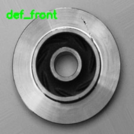
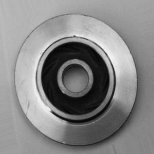
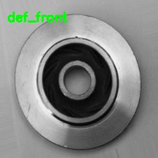
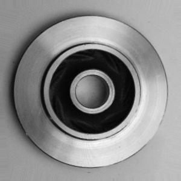
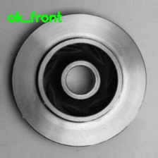
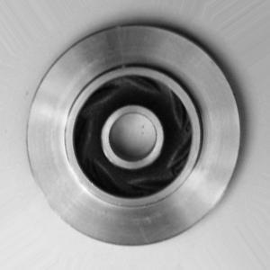
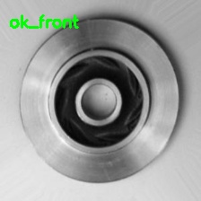

# casting-product-classification

# Dataset: 

We have used <b>casting product image data for quality inspection</b> data. The dataset contains total 7348 image data.
Data is already splitted into training and testing. Both train and test folder contains def_front and ok_front sub folders.

train :- def_front have 3758 and ok_front have 2875 images test :- def_front have 453 and ok_front have 262 images

You can find data <a href="https://www.kaggle.com/ravirajsinh45/real-life-industrial-dataset-of-casting-product">here</a>

# Files:

1. train.py: This file is used for fine_tuning VGG16 on this dataset over 5 epochs.
2. predict.py: This file is used for predicting single image.

# How to run?

To run `train.py` , insert following command in command line

`python train.py --train datasets/casting_data/train --test datasets/casting_data/test --batch_size 32 --model output/VGG16.hdf5 --figpath output/VGG16.png`

To run `predict.py` , insert following command in command line

`python predict.py --model output/VGG16.hdf5 --image input/def_front/test1.jpeg --output output/def_front/test1.jpeg`

# Results:

**Result of `train.py`**
[INFO] training model... 
Epoch 1/5 
207/207 [==============================] - 36s 174ms/step - loss: 0.4758 - accuracy: 0.9046 - val_loss: 0.0072 - val_accuracy: 0.9901 
Epoch 2/5 
207/207 [==============================] - 24s 115ms/step - loss: 0.0478 - accuracy: 0.9882 - val_loss: 0.0135 - val_accuracy: 0.9927 
Epoch 3/5 
207/207 [==============================] - 23s 112ms/step - loss: 0.0449 - accuracy: 0.9885 - val_loss: 0.0107 - val_accuracy: 0.9927 
Epoch 4/5 
207/207 [==============================] - 24s 114ms/step - loss: 0.0467 - accuracy: 0.9868 - val_loss: 0.0045 - val_accuracy: 0.9927 
Epoch 5/5 
207/207 [==============================] - 23s 110ms/step - loss: 0.0379 - accuracy: 0.9900 - val_loss: 0.0016 - val_accuracy: 0.9898 

**Result of `predict.py`**

* Input Image:

* Output Image:

* Input Image:

* Output Image:

* Input Image:

* Output Image:

* Input Image:

* Output Image:

